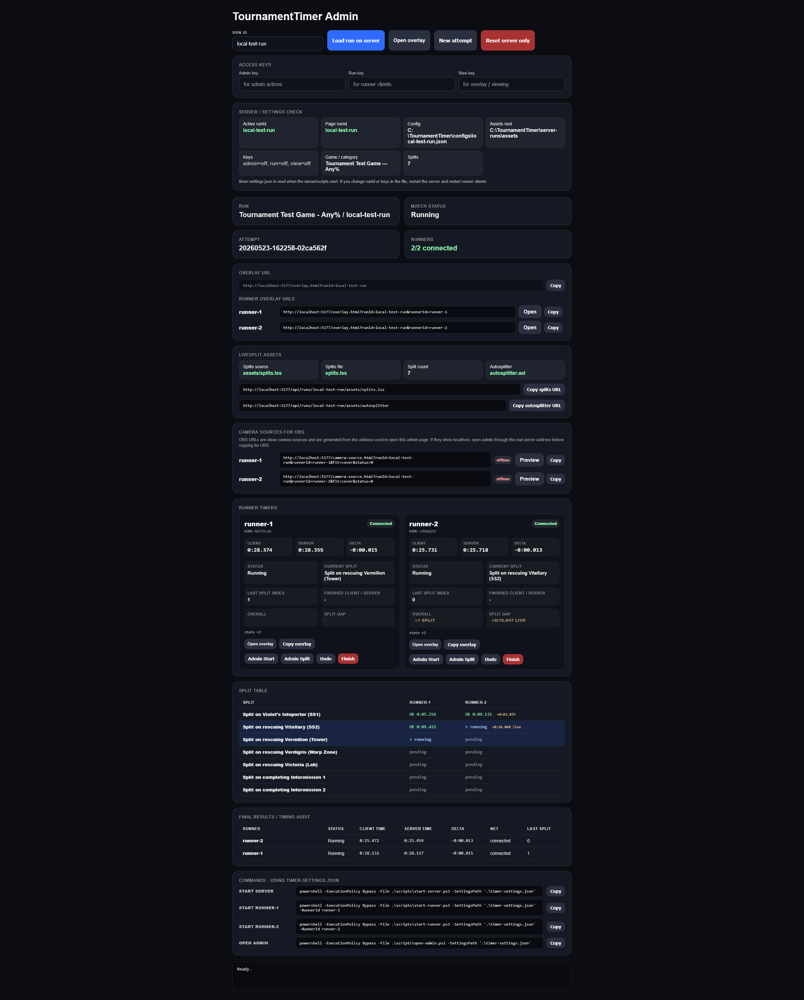
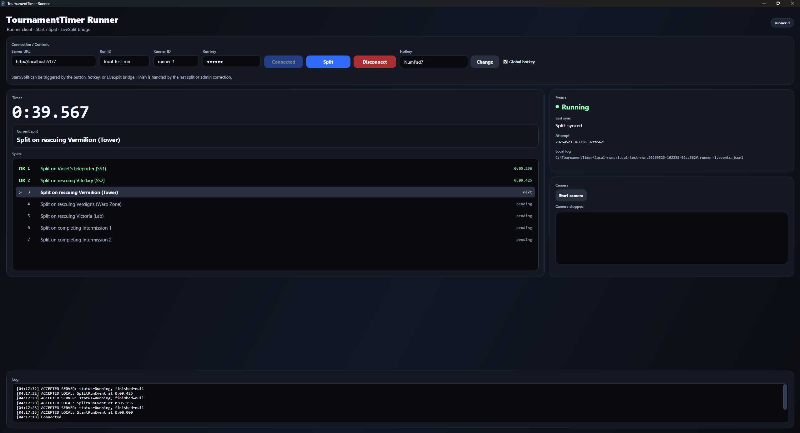
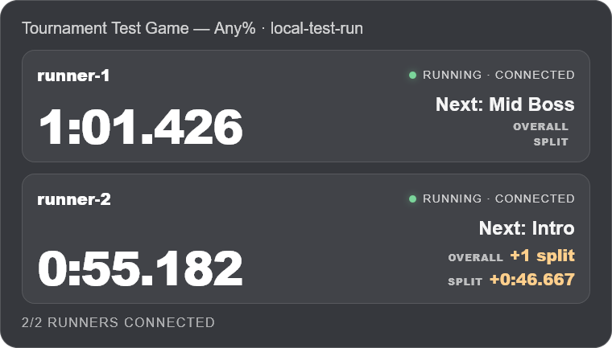
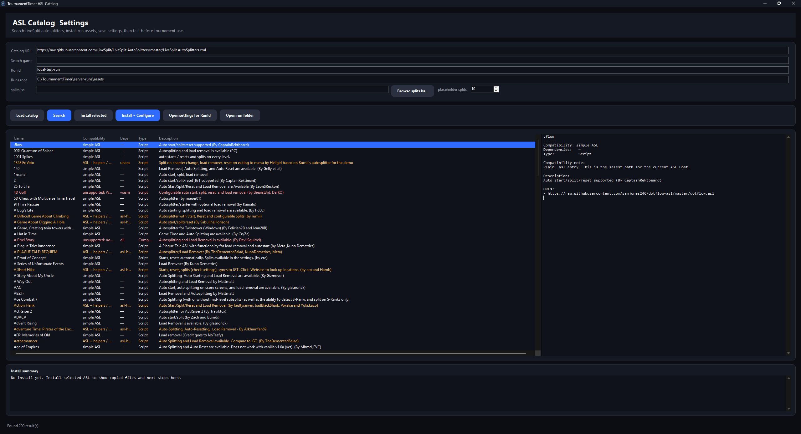
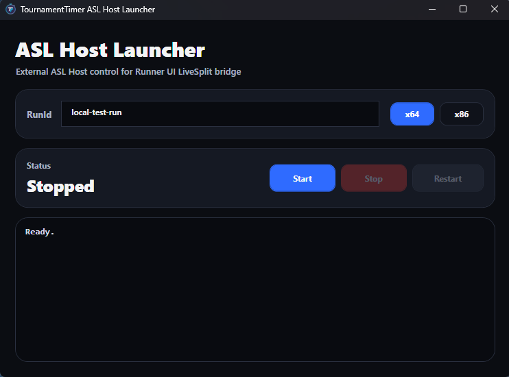
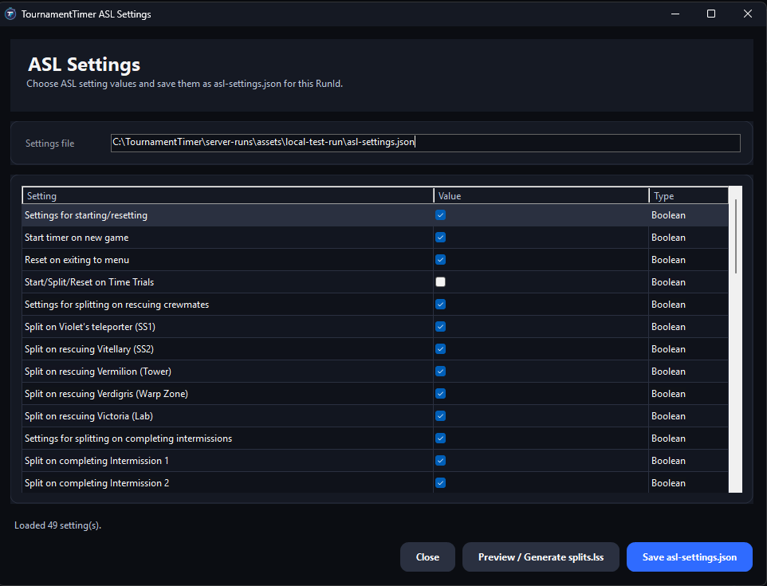

# TournamentTimer

TournamentTimer is a tournament timing server/admin layer for speedrun events.

It is not intended to replace LiveSplit. LiveSplit can remain the source of autosplitters, game time, LRT and comparisons, while TournamentTimer provides server-side state, admin tools, logs, audit data and OBS-friendly overlays.

## What it is

TournamentTimer is a small tournament infrastructure layer for speedrun races:

- central timing server;
- admin panel for race control and corrections;
- runner client for Start/Split, local logging and sync;
- OBS-friendly overlay pages;
- camera source pages for runner webcams;
- client/server timing audit;
- optional LiveSplit bridge;
- experimental ASL Host / ASL Catalog tooling.

The main idea is simple: the server keeps the official race state, runner clients send events, admins handle edge cases, and OBS displays what the server knows.

## Screenshots

## What it is not

TournamentTimer is not:

- a LiveSplit replacement;
- a full autosplitter runtime;
- a full streaming platform;
- a Discord/voice replacement;
- an anti-cheat system;
- a SaaS product;
- a guarantee that every LiveSplit autosplitter will work headlessly.

LiveSplit can still be used. For games where LiveSplit remains the reliable autosplitter source, TournamentTimer can receive Start/Split events through the LiveSplit bridge and keep the tournament-side state, logs, audit and overlays.

## Core components

| Component | Role |
| --- | --- |
| Server | Holds run config, attempt state, runner states, logs, snapshots, access keys and display state. |
| Runner UI | Runner-side client for connecting to the server, sending Start/Split, keeping a local log, syncing events and optionally sharing camera video. |
| Admin panel | Organizer UI for monitoring runners, creating attempts, emergency corrections, timing audit and OBS links. |
| Overlay | Browser pages for OBS: overall race overlay, per-runner overlays and camera sources. |
| LiveSplit bridge | Optional LiveSplit component that forwards Start/Split events to Runner UI. |
| ASL Host | Experimental helper/runtime for running ASL autosplitters without the full LiveSplit UI. |
| ASL Catalog / Settings | Admin tooling for finding ASL autosplitters, preparing run assets and saving ASL settings. |

## Timing model

TournamentTimer stores both client-side and server-side timing data.

- **Client time** is the time reported by Runner UI or LiveSplit. This is normally the official event time.
- **Server time** is used for audit and control.
- **Delta** shows the difference between server-side receipt time and client-side event time.

This matters when a runner has network issues. If a split happened at `10:00.000` on the runner machine but reached the server several seconds later, the server can still keep the client time as the official split time while preserving audit data.

## Reliability features

TournamentTimer is designed around real tournament annoyances:

- local runner event logs;
- server event logs;
- server sync logs;
- admin audit logs;
- server snapshots;
- duplicate event detection through client event IDs;
- attempt IDs to prevent old events from being applied to a new race;
- restore after server restart;
- offline replay after temporary server/network loss;
- admin-only emergency correction controls.

## Access keys

TournamentTimer uses simple access keys, not a full account system.

| Key | Purpose |
| --- | --- |
| Admin key | Admin panel and dangerous actions such as New attempt, Reset, Undo and Finish. |
| Run key | Runner clients and runner-side event submission. |
| View key | Overlay and read-only display pages. |

These keys are a lightweight barrier for small tournament deployments. They are not a substitute for a full authentication/authorization system.

## Packages

Typical release packages:

- `TournamentTimer-server-admin-win-x64.zip`
- `TournamentTimer-server-admin-linux-x64.zip`
- `TournamentTimer-runner-win-x64.zip`
- `TournamentTimer-full-win-x64.zip`

Server/admin packages are for organizers. Runner packages are for participants. Linux packages are server/admin only; runner UI and ASL tools are Windows-side tools.

## Quick start

1. Copy `timer-settings.example.json` to `timer-settings.json` locally.
2. Set `runId`, `serverUrl`, `runConfigPath`, `adminKey`, `runKey` and `viewKey`.
3. Prepare a run config in `configs/`.
4. Put LiveSplit `.lss` and optional autosplitter assets in `server-runs/assets/<RunId>/`.
5. Start the server.
6. Open the admin panel.
7. Open Runner UI on runner machines and connect with the run key.
8. Add overlay URLs to OBS.
9. Before the real race, create a clean attempt from the admin panel.

## LiveSplit integration

TournamentTimer can work together with LiveSplit. The bridge plugin runs inside LiveSplit and forwards Start/Split events to Runner UI on the same runner machine. Runner UI then validates local state, writes logs and syncs with the TournamentTimer server.

This keeps LiveSplit useful for existing autosplitters while moving tournament state, audit and overlays into TournamentTimer.

## ASL Host status

ASL Host is experimental tooling for running ASL autosplitters without the full LiveSplit UI.

Supported direction:

- simple ASL scripts;
- ASL scripts with settings through `asl-settings.json`;
- some helper-dependent ASLs after testing.

Not guaranteed:

- the entire LiveSplit autosplitter catalog;
- WASM / AutoSplittingRuntime / ASR autosplitters;
- .NET component autosplitters;
- every helper-dependent ASL.

If a specific autosplitter does not work headlessly, the fallback path is LiveSplit + TournamentTimer Bridge, manual Start/Split, or admin correction.

## Use terms and license

TournamentTimer is distributed under custom use terms.

Short version:

- author project by Ilya Khaiko;
- commercial use is prohibited without separate written permission;
- public, monetized, sponsored, promotional or paid events require separate written permission;
- modification, redistribution, resale, rental, white-label use and inclusion in paid production/event packages are prohibited without separate written permission;
- if there is doubt whether an event is commercial or promotional, it requires permission.

See:

- `LICENSE.txt`
- `README_USAGE_TERMS_RU.md`
- `NOTICE.txt`
## Author

Author / maintainer: Ilya Khaiko

- Telegram: `@diktor_ilyakhaiko`
- YouTube: `https://www.youtube.com/@diktor_ilyakhaiko`
- Email: `ilyakhaiko@gmail.com`
